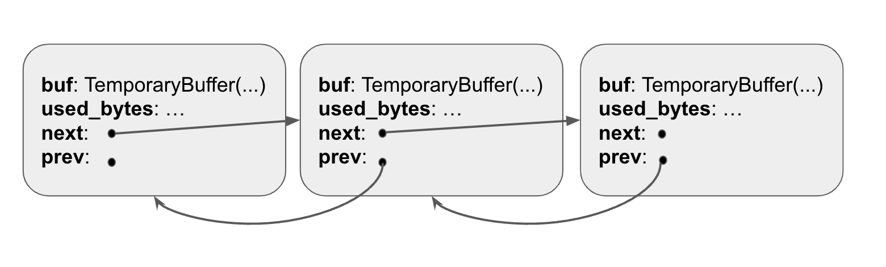
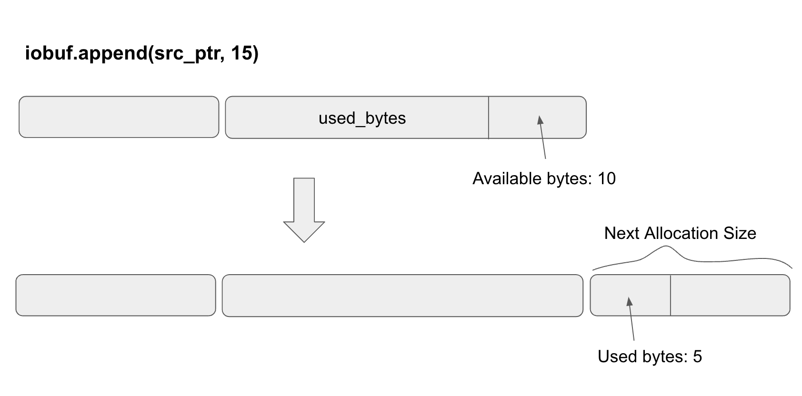

# IoBuf

My toy `iobuf` implementation is based on `Redpanda`'s `iobuf` [implementation](https://github.com/redpanda-data/redpanda/blob/28b5c47fb4d2d23322622e1ba52f973179ba504e/src/v/bytes/iobuf.h#L31).

Iobuf is pretty much just a linked list of `TemporaryBuffer`s. Each `Temporary Buffer` is wrapped around an `IoFragment`, which is like a linked list node with next/prev pointers to other fragments.



### API

**Constructor**

There are a few different ways to create an `iobuf`. The easiest way is to just use the `new() -> Iobuf` as follows:

```rust
let mut iobuf = IoBuf::new();
```

**Append**

There are a few different ways to `append` data to an `iobuf`. Here are some of the method signatures to append:

```rust
fn append(&mut self, src: *const u8, len: usize) -> ();
fn append_temporary_buffer(&mut self, buffer: TemporaryBuffer);
fn append_fragment(&mut self, fragment: IoFragment);
```

**Iterator**

To create an iterator over the `IoFragment`s that make up the `iobuf`, you can call the `begin()` method with the signature: `fn begin<'a>(&'a self) -> IoFragmentIter<'a>`.

I’ll go deeper into iterators in the next page where I talk about `IoIteratorConsumer`.

### Internals

```rust
pub struct IoBuf {
    frags: LinkedList<IoFragmentAdapter>,
    // number of bytes the IoBuf contains
    size: usize,
}
```

As we can see from the definition of `IoBuf`, it’s pretty much just a linked list of `IoFragment` nodes. The `IoBuf` itself doesn’t store any data, it just holds pointers to `temporary buffer` instances, which actually hold the data.

Similar to Redpanda’s implementation, I also used an intrusive linked list from the [intrusive_collections trait](https://amanieu.github.io/intrusive-rs/intrusive_collections/linked_list/index.html).

The main difference between an intrusive collection and a normal collection is that intrusive collections don’t allocate memory themselves. This means that the `next` and `prev` pointers directly live inside the nodes. Intrusive collections are good because it eliminates dynamic memory allocation, which may cause the memory pools to be fragmented.

To work with the intrusive linked list, I just needed to use the `intrusive_adapter` macro like this:

```rust
intrusive_adapter!(pub IoFragmentAdapter = Box<IoFragment>: IoFragment { link: LinkedListLink });
```

The macro automatically creates an `IoFragmentAdapter` with `next` and `prev` pointers. `IoFragmentAdapter` is the actual linked list node the `iobuf` uses.

The actual definition of `IoFragment` is:

```rust
pub struct IoFragment {
    used_bytes: RefCell<usize>,
    buf: TemporaryBuffer,
    pub link: LinkedListLink,
}
```

**Append**

Let’s look at how we implement `fn append(&mut self, src: *const u8, len: usize) -> ();`



The diagram shows an `iobuf` with 2 fragments. The second fragment has `10` available bytes. If we insert `15` bytes into the `iobuf`, it will first fill in the available bytes. Then it will create a new `io_fragment` with the next allocation size and fill the remaining `5` bytes into the next fragment.

Computing the next allocation size is based on the [iobuf allocation table logic provided by Redpanda](https://github.com/redpanda-data/redpanda/blob/28b5c47fb4d2d23322622e1ba52f973179ba504e/src/v/bytes/details/io_allocation_size.h#L32). In general, fixed sizing and size capping help reduce memory fragmentation.

Here is the implementation of `append`:

```rust
pub fn append(&mut self, src: *const u8, len: usize) -> () {
        if len <= self.available_bytes() {
            let fragment = self.get_last_fragment();
            self.size += fragment.append(src, len);
            return;
        }
        let mut remaining = len;
        let mut ptr = src;
        while remaining > 0 {
            self.append_new_fragment(remaining);
            let appended_size = self.get_last_fragment().append(ptr, remaining);
            ptr = unsafe { ptr.add(appended_size) };
            remaining -= appended_size;
            self.size += appended_size;
        }
    }
```

**Share**

Sharing an `iobuf` based on a `pos` and a `len` simply creates a new `iobuf` and find the `io_fragment`s that intersect with the share range. If it is, we use the `temporary_buffer`'s `share` method to get a reference of the temporary buffer.

```rust
pub fn share(&self, pos: usize, len: usize) -> IoBuf {
        let mut ret = IoBuf::new();
        let mut remaining = len;
        let mut pos = pos;
        for fragment in self.frags.iter() {
            if remaining == 0 {
                return ret;
            }
            if pos >= fragment.size() {
                pos -= fragment.size();
                continue;
            }

            let right = std::cmp::min(pos + remaining, fragment.size() - 1);
            let buffer = fragment.share(pos, right);
            ret.append_temporary_buffer(buffer);
            remaining -= right - pos - 1;
        }
        ret
    }
```

In other words, `share` increments the reference count of each of the temporary buffers that it intersects. When the `iobuf` drops, all the reference counts of the temporary buffers drop. Each temporary buffer is responsible for deallocating the memory if the reference count reaches zero.

Check out the implementation of iobuf [here](https://github.com/brianshih1/mini-iobuf/blob/main/src/iobuf.rs).

### IoIteratorConsumer

To get data out of an `iobuf`, the best way is to use a consumer iterator. My `IoIteratorConsumer` implementation is based on Redpanda’s implementation. Check out their source code [here](https://github.com/redpanda-data/redpanda/blob/28b5c47fb4d2d23322622e1ba52f973179ba504e/src/v/bytes/details/io_iterator_consumer.h#L47).

```rust
let mut iobuf = IoBuf::new();
let values1 = generate_random_u8_vec(1000);
iobuf.append(values1.as_ptr(), values1.len());

let values2 = generate_random_u8_vec(3000);
iobuf.append(values2.as_ptr(), values2.len());

let mut consumer = IoIteratorConsumer::new(iobuf.begin());
let arr = consumer.consume_to_arr(1000);
assert_eq!(values1, arr);

let arr2 = consumer.consume_to_arr(3000);
assert_eq!(values2, arr2);
```

This example showcases how the `IoIteratorConsumer` is used. You initialize it with a pointer to an `IoFragmentIter`. You then invoke `consumer_to_arr` to copy the data into an array. Note that each call to `consume_to_arr` would advance the iterator pointer under the hood.

The method `consume_to_arr` is actually powered by the `consume` method, which takes a callback with the start pointer and the size.

```rust
pub fn consume<T>(&mut self, n: usize, consumer: T)
    where
        T: Fn(*const u8, usize) -> (),
    {
        let mut consumed = 0;
        while self.current_frag.is_some() && consumed < n {
            let segment_bytes_left = self.segment_bytes_left();

            if segment_bytes_left == 0 {
                self.current_frag = self.frag_it.next();
                self.frag_index = self.current_frag.map(|frag| frag.get_start());
                continue;
            }
            let step = std::cmp::min(segment_bytes_left, n - consumed);
            let frag_index = self.frag_index.unwrap();
            consumer(frag_index, step);
            self.frag_index = Some(unsafe { frag_index.add(step) });
            consumed += step;
        }
    }
```

The algorithm basically iterates over the fragments and calling callbacks with the start pointer and the size in that fragment to consume. Once the number of elements that have been consumed reaches n, the iterator stops.
