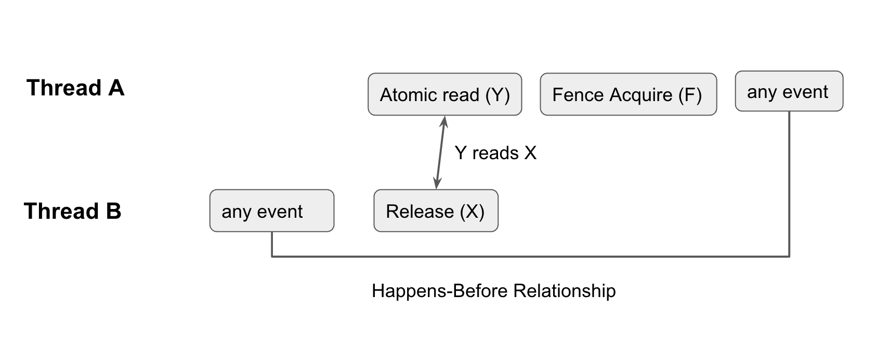

# Temporary Buffer

Before we implement the `iobuf`, we need to first implement its building block, the `Temporary Buffer`.

Temporary Buffer is a memory management abstraction for a contiguous region of memory. What makes temporary buffers different from buffers like `Vec` is that the underlying memory can be shared with another `temporary_buffer`. In other words, it is a buffer with an automatic reference count, kind of like an `Arc` in Rust.

My implementation is largely inspired by Seastar’s [implementation](https://github.com/scylladb/seastar/blob/e908cfce2d4488976f3b91906954f435aaa99238/include/seastar/core/temporary_buffer.hh).

## API

**Constructor**

To create a `TemporaryBuffer`, you use the `new: (size: usize) -> TemporaryBuffer` API.

```rust
let buffer = TemporaryBuffer::new(12);
```

**Write**

To write into a `TemporaryBuffer`, you call `get_write(&self) -> Option<*mut u8>`. It is dangerous to return a `mutable raw pointer` if there is another reference to the `TemporaryBuffer` as the other buffer may not expect data to change. Therefore, `get_write` would return `None` if there are more than one reference to the buffer.

```rust
let buffer = TemporaryBuffer::new(12);
let ptr = buffer.get_write().unwrap();
let data: Vec<u8> = vec![1, 2, 3];
unsafe {
    std::ptr::copy_nonoverlapping(data.as_ptr(), ptr, 3);
}
```

**Share**

To share a buffer, you can either use `share(&self) -> TemporaryBuffer` to share the entire buffer or `share_slice(&self, pos: usize, len: usize) -> TemporaryBuffer` to get a sliced reference to the temporary buffer.

Note that in either scenario, the underlying data will not be destroyed until all references to the buffer is destroyed. This means that having a tiny slice of a temporary buffer would result in the entire data the original temporary buffer holds to be held in memory.

```rust
let buffer = TemporaryBuffer::new(12);
	{
	    let second = buffer.share();
	    assert_eq!(buffer.get_ref_count(), 2);
	
	    {
	        let slice = buffer.share_slice(0, 3);
	        assert_eq!(buffer.get_ref_count(), 3);
	    }
	}
assert_eq!(buffer.get_ref_count(), 1);
```

In the example above, we created multiple references to the `buffer` in different scopes. In the deepest scope, the reference count for the `buffer` is 3. But in the outmost scope, since the scoped references get dropped, there is only 1 ref count.

## Internals

Conceptually, a `temporary_buffer` is quite similar to an `Arc`. Instead of `Arc::clone`, you perform `share` or `share_slice` to increment the ref count. When the reference count reaches 0, the underlying data is deallocated.

```rust
pub struct TemporaryBuffer {
    deleter: NonNull<BufferInternal>,
    size: usize,
    buffer: *mut u8,
}

struct BufferInternal {
    ref_counter: AtomicUsize,
    size: usize,
    buffer: *mut u8,
}
```

This is what the `TemporaryBuffer` looks like under the hood:

Each `TemporaryBuffer` has a `NonNull` raw pointer to a `BufferInternal`. `BufferInternal` keeps track of the reference counts and deallocates the memory when the reference count reaches 0.

This is the implementation for the constructor:

```rust
pub fn new(size: usize) -> Self {
    let layout = Layout::array::<u8>(size).unwrap();
    let buffer = unsafe { alloc(layout) };
    TemporaryBuffer {
        deleter: NonNull::from(Box::leak(Box::new(BufferInternal {
            ref_counter: AtomicUsize::new(1),
            size,
            buffer,
        }))),
        size,
        buffer,
    }
}
```

Here, we used `Box::new` to create a new allocation and `Box::leak` to give up ownership of the value without deallocating the memory associated with it. Then we use `NonNull` to get the pointer to the memory.

This is the implementation of `share_slice`. Each time it’s called, the `deleter`'s `ref_count` is incremented by one. We can use `Relaxed` memory ordering here because

```rust
pub fn share_slice(&self, pos: usize, len: usize) -> TemporaryBuffer {
    if self.get_deleter().ref_count.fetch_add(1, Relaxed) > usize::MAX / 2 {
        std::process::abort();
    }
    TemporaryBuffer {
        deleter: self.deleter,
        size: len,
        buffer: unsafe { self.buffer.add(pos) },
    }
}
```

Just as we increment the ref count when sharing the buffer, we decrement the ref count (with `fetch_sub` when the buffer gets dropped (i.e. out of scope).

```rust
impl Drop for TemporaryBuffer {
    fn drop(&mut self) {
        if self.get_deleter().ref_count.fetch_sub(1, Release) == 1 {
            fence(Acquire);
            unsafe {
                let layout = Layout::array::<u8>(self.deleter.as_ref().size).unwrap();
                dealloc(self.deleter.as_ref().buffer, layout);
                drop(Box::from_raw(self.deleter.as_ptr()));
            }
        }
    }
}
```

If `fetch_sub` returns 1, we need to ensure that no other references have access to the underlying memory. Note that this isn’t trivial as the `buffer` is not part of the `atomic` ref_count. To guarantee that any non-atomic loads and stores to buffer occur before the final `fetch_sub`, we need to establish a `happens-before relationship` between the final `fetch_sub` and all other `fetch_subs`.



The figure above illustrates how we establish the happens-before relationship. Note that all atomic operations (even relaxed ones) have total modification order for that atomic variable. This means that all modifications of the same atomic variable happen in an order that is the same from the perspective of every single thread. This means that if `fetch_sub` returns `1`, it is the last `fetch_sub`.

We use an `acquire fence` to guarantee that whatever happens after the fence happens after any event before all other `final_sub`s. Since loads or modifications to the `buffer` count as `any event`, we guarantee that after the fence, no other threads have access to the underlying memory.

Check out the implementation on github [here](https://github.com/brianshih1/mini-iobuf/blob/main/src/temporary_buffer.rs).
